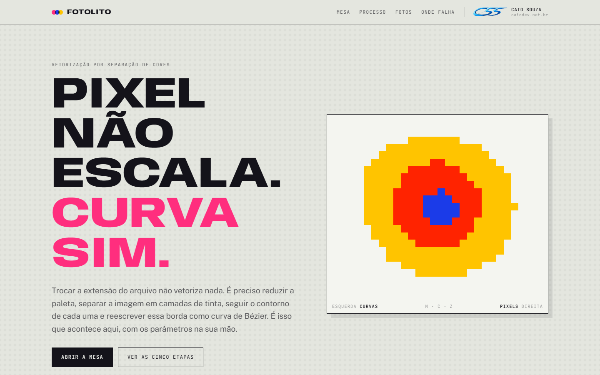
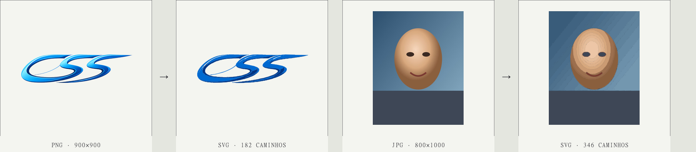

# Fotolito

**Vetorizador de imagens de verdade** — PNG, JPG, WebP e AVIF entram como matriz de pixels, um SVG de caminhos sai. Construído em Next.js, roda inteiro no servidor (Sharp + ImageTracer.js + SVGO), sem nenhuma dependência de canvas no navegador.



> Trocar a extensão do arquivo não vetoriza nada. Vetorizar exige reduzir a paleta, separar a imagem em camadas de cor, seguir o contorno de cada uma e reescrever essa borda como curva de Bézier. É isso que o Fotolito faz — com os parâmetros do algoritmo expostos, não escondidos atrás de um botão mágico.

## Exemplo

| Original | Vetorizado |
| --- | --- |
|  | |

À esquerda o logo e um retrato sintético como enviados; à direita, o SVG que sai da mesa — 182 e 346 caminhos, respectivamente, com a receita **Ilustração**/**Retrato** de fábrica.

## Por que existe

Conversores online de "PNG para SVG" costumam falhar de três formas previsíveis: ruído de compressão JPG vira vetor, a quantização de cor é rígida demais ou frouxa demais, e o contorno sai serrilhado ou arredondado sem controle. O Fotolito expõe as variáveis reais do processo — quantização, tolerância de curva, descarte de ruído, selagem de emenda — em vez de tentar adivinhar por você, e mede o resultado a cada etapa (caminhos, nós, peso, peso com gzip) para que o ajuste seja guiado por número, não por tentativa.

## Recursos

- **Cinco etapas visíveis**: quantização de cor, separação em camadas, detecção de contorno, ajuste de curvas de Bézier e montagem do SVG — cada uma explicada na própria página.
- **Oito receitas testadas** (Marca, Ilustração, Fiel, Pixel art, Retrato, Pop art, Preto e branco, Tons de cinza, Logo), cada uma com valores medidos contra imagens reais, não chutados.
- **Modos de cor**: paleta cheia, tons de cinza ou preto-e-branco com corte ajustável — os dois últimos com paleta explícita para não perder a transparência.
- **Recorte antes de traçar**: arraste sobre a imagem original para vetorizar só a parte que importa; o fundo de uma foto real costuma gerar a maioria dos caminhos descartáveis.
- **Correção de pontinhos**: selagem de emenda entre formas vizinhas e chapa de fundo na cor dominante eliminam o vazamento de anti-aliasing entre cores lisas adjacentes.
- **Compactação com um clique**: roda SVGO (`multipass`, `floatPrecision: 1`, `mergePaths`) depois do traçado e mostra o antes/depois em bytes e em gzip.
- **Aviso antes de travar o navegador**: a interface avisa quando a combinação de parâmetros tende a gerar dezenas de milhares de caminhos, antes de você esperar o resultado.
- Nada é gravado em disco — a imagem entra, o SVG sai na resposta, fim.

## Stack

[Next.js 15](https://nextjs.org/) (App Router) · [React 19](https://react.dev/) · [Sharp](https://sharp.pixelplumbing.com/) para o pré-processamento de pixels · [ImageTracer.js](https://github.com/jankovicsandras/imagetracerjs) para o traçado · [SVGO](https://github.com/svg/svgo) para a compactação.

## Rodando localmente

```bash
npm install
npm run dev      # http://localhost:3000
```

Build de produção:

```bash
npm run build
npm start
```

Requer Node 18+ (testado em Node 24). Sem variáveis de ambiente — o app não fala com nenhum serviço externo.

## Como funciona

`app/api/convert/route.js` executa o pipeline inteiro no servidor, sem nada em disco:

1. **Recorte** (opcional) — `sharp().extract()` em coordenadas relativas, antes de tudo.
2. **Pré-processamento** — corrige orientação EXIF, redimensiona para o *Detalhe da leitura*, aplica mediana (ruído de JPG) e desfoque leve, extrai a matriz RGBA crua.
3. **Modo de cor** — em cinza/P&B, a matriz é reescrita com luminância e uma paleta explícita antes do traçado.
4. **Quantização e traçado** (ImageTracer.js) — agrupa cores, separa em camadas, segue o contorno de cada máscara e ajusta curvas de Bézier com a tolerância pedida.
5. **Selagem e chapa de fundo** — cada `<path>` ganha um contorno fino da própria cor; uma `<rect>` na cor dominante cobre qualquer vazamento residual.
6. **Montagem** — os caminhos viram um `<svg>` com `viewBox`, dimensões originais e `fill-rule="nonzero"` explícito.

A resposta é JSON com o SVG e as estatísticas do traçado. `POST /api/optimize` recebe esse SVG e devolve a versão compactada pelo SVGO, com o antes/depois medido em bytes e gzip.

Os detalhes de cada etapa — parâmetros aceitos pela API, valores de cada receita, como a selagem de emenda resolve o vazamento entre cores lisas, os números da compactação e o que esperar ao vetorizar fotos de pessoas — estão em **[docs/PIPELINE.md](docs/PIPELINE.md)**.

## Estrutura

```
app/
  layout.js              fontes e metadados
  page.js                hero, mesa, as cinco etapas, diagnóstico de fotos
  Desk.js                a mesa de trabalho: upload, receitas, ajustes, comparação
  PlateMark.js            a chapa do hero — varredura de pixels para curvas
  Imprint.js              colofão: créditos do autor e a paleta da marca
  globals.css             tokens de cor e tipografia
  lib/svgTools.js         medição, selagem de emenda e compactação (SVGO)
  api/convert/route.js    pipeline de vetorização
  api/optimize/route.js   compactação SVGO
docs/
  PIPELINE.md             referência técnica: API, receitas medidas, algoritmo
```

## Créditos

Projeto, design e código de **Caio Souza** — [Caio Souza Solutions](https://caiodev.net.br/pt-BR).
[WhatsApp](https://wa.me/5519971394130) · [github.com/iKosMooh](https://github.com/iKosMooh)

O cabeçalho e o rodapé usam a paleta da marca, lida direto dos tokens `--brand-*` de caiodev.net.br:

| Token | Hex |
| --- | --- |
| `--brand-electric` | `#0511F2` |
| `--brand-dark` | `#033E8C` |
| `--brand-accent` | `#0597F2` |
| `--brand-cyan` | `#05AFF2` |
| `--foreground` (escuro) | `#0D0D0D` |

Todos os direitos reservados a Caio Souza Solutions.
